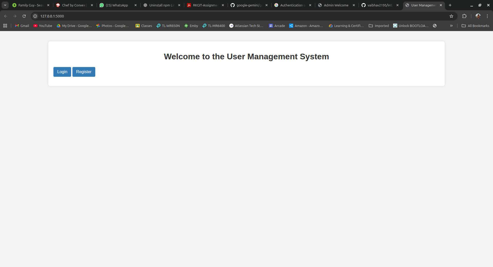
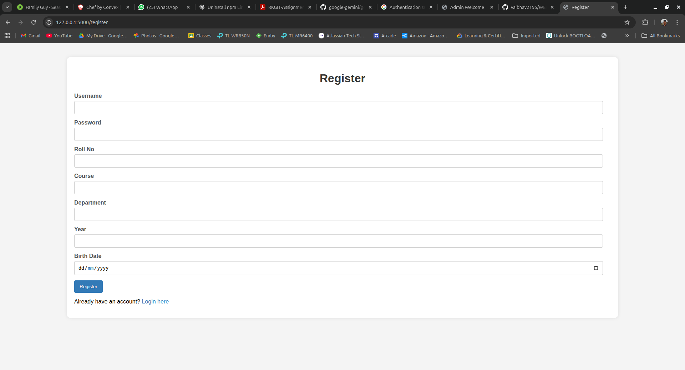
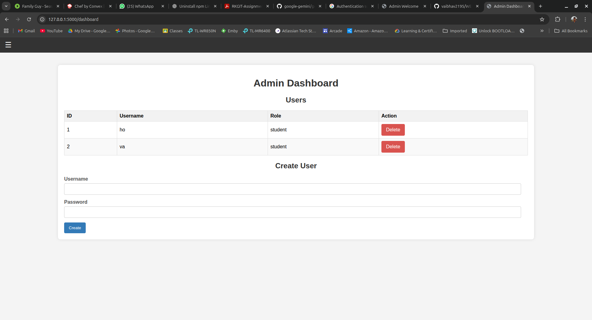
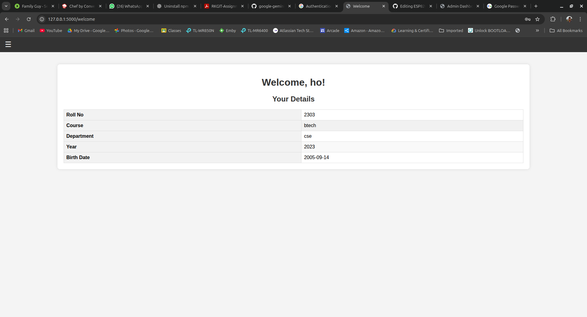

# User Management Web Application

This is a simple role-based user management web application built with Python and Flask.

## Tech Stack

*   **Backend:** Python, Flask
*   **Frontend:** HTML, CSS, JavaScript
*   **Database:** SQLite

## File Structure

```
user-management-app/
├── app.py
├── database.db
├── database.py
├── README.md
├── requirements.txt
├── schema.sql
├── seed.py
├── static/
│   └── style.css
├── templates/
│   ├── admin_welcome.html
│   ├── base.html
│   ├── base_anonymous.html
│   ├── change_password.html
│   ├── dashboard.html
│   ├── index.html
│   ├── login.html
│   └── register.html
└── venv/
```

## Project Setup

1.  **Clone the repository:**

    ```
    git clone <repository-url>
    ```

2.  **Navigate to the project directory:**

    ```
    cd user-management-app
    ```

3.  **Create a virtual environment:**

    ```
    python3 -m venv venv
    ```

4.  **Activate the virtual environment:**

    ```
    source venv/bin/activate
    ```

5.  **Install the dependencies:**

    ```
    pip install -r requirements.txt
    ```

6.  **Initialize the database:**

    ```
    python3 app.py
    ```

    This will create the `database.db` file.

7.  **Seed the database with the admin user:**

    ```
    python3 seed.py
    ```

8.  **Run the application:**

    ```
    python3 app.py
    ```

    The application will be running at `http://127.0.0.1:5000`.

## Admin Credentials

*   **Username:** admin
*   **Password:** admin

## API Endpoints

### Authentication

| Method | Endpoint     | Role      | Description                                      |
| :----- | :----------- | :-------- | :----------------------------------------------- |
| GET    | `/`          | Anonymous | Displays the index page.                           |
| GET    | `/login`     | Anonymous | Displays the login page.                           |
| POST   | `/login`     | Anonymous | Logs in a user.                                  |
| GET    | `/register`  | Anonymous | Displays the registration page.                    |
| POST   | `/register`  | Anonymous | Registers a new student user.                      |
| GET    | `/logout`    | User      | Logs out the current user.                       |

### User

| Method | Endpoint          | Role   | Description                                      |
| :----- | :---------------- | :----- | :----------------------------------------------- |
| GET    | `/welcome`        | User   | Displays the welcome page for the logged-in user. |
| GET    | `/change_password`| User   | Displays the change password page.               |
| POST   | `/change_password`| User   | Changes the password of the current user.        |

### Admin

| Method | Endpoint         | Role  | Description                                      |
| :----- | :--------------- | :---- | :----------------------------------------------- |
| GET    | `/dashboard`     | Admin | Displays the admin dashboard with a list of students. |
| POST   | `/create_user`   | Admin | Creates a new student user.                      |
| GET    | `/delete_user/<id>` | Admin | Deletes a student user by their ID.              |

## Screenshots

### HOME Page




### Register Page



### Admin Dashboard



### Student Welcome Page




